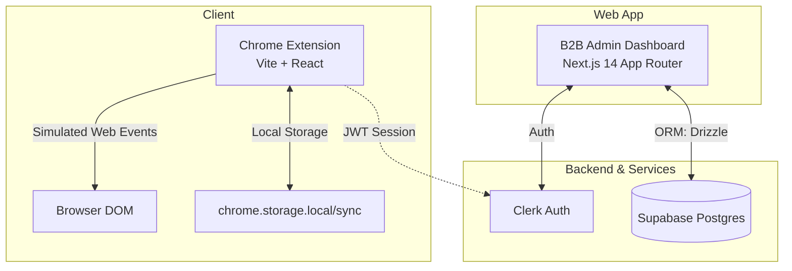
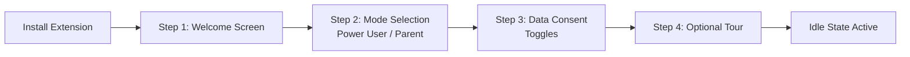
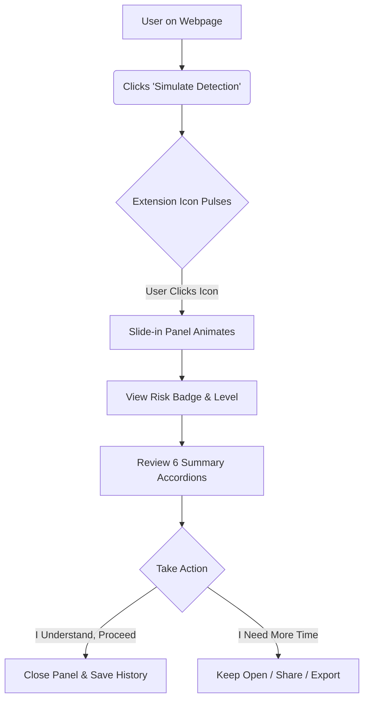
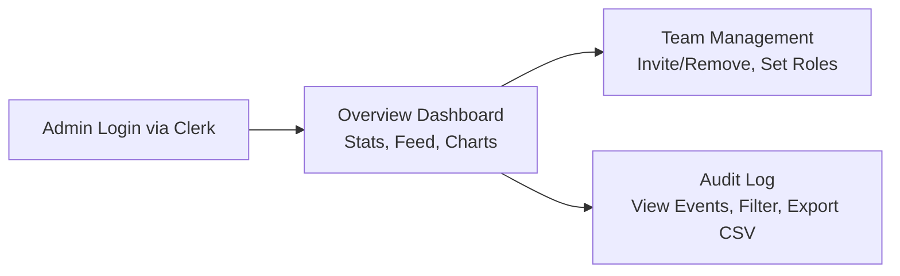
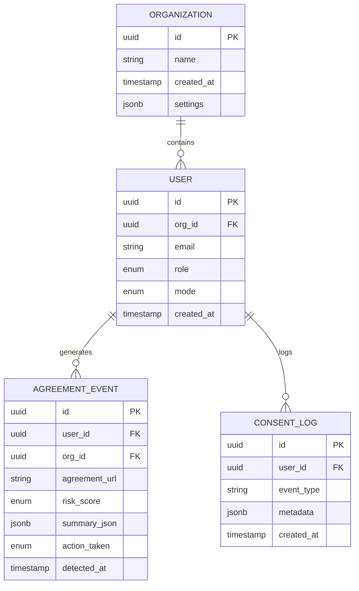

# ClearSign – AI Prototyping Spec & Product Document

## Product Overview

**ClearSign** is a Manifest V3 Chrome extension that automatically detects legal agreements—such as Terms of Service, End User License Agreements (EULA), and Privacy Policies—visible in the browser DOM. It generates AI-powered summaries with risk scoring, distilled into plain English for maximum clarity. 

### Target Audiences
1. **Privacy-Conscious Power Users**: Seeking detailed legal insights and implications.
2. **Parents/Guardians**: Aiming to protect minors from risky online agreements and obscure data policies.

---

## Architecture & Tech Stack

### Core Technologies
* **Frontend/Dashboard**: Next.js 14 (App Router), TypeScript, React Server Components
* **Extension**: Vite + React, Manifest V3
* **Database & ORM**: Supabase (Postgres), Drizzle ORM
* **Authentication**: Clerk (org-level for dashboard), JWT for extension
* **Hosting**: Vercel (Next.js), Local Unpacked Extension (Chrome)
* **Libraries & UI**: shadcn/ui, Tailwind CSS, Framer Motion, Lucide React, Recharts, react-hook-form, zod, clsx, tailwind-merge

---

## Design & Visual Style

* **Component Library**: shadcn/ui
* **Styling**: Tailwind CSS (Utility-first)
* **Color Scheme**: 
  * Primary: `#1A1A2E` | Secondary: `#16213E` | Accent: `#0F3460` | Background: `#F8FAFC`
  * Risk Colors: Low `#22C55E` (Green), Medium `#F59E0B` (Amber), High `#EF4444` (Red)
* **Typography**: Inter font, generous line height (1.6), spacious layout.

---

## Core User Flows

### 1. Extension Onboarding Flow

### 2. Agreement Detection & Summary Flow

### 3. B2B Admin Dashboard Flow

---

## Data Model

### APIs / Actions
* `GET /api/dashboard/stats` — Org aggregate stats (users, activity, avg risk)
* `GET /api/dashboard/events` — Paginated, filterable activity log
* `POST /api/dashboard/team/invite` — Invite user
* `DELETE /api/dashboard/team/:userId` — Remove user

---

## Pages & Navigation

### Chrome Extension (React + Vite)
* **`/onboarding`**: Full-screen wizard on first install (Welcome, Mode Selection, Consent, Tour).
* **`Popup Panel`**: Slide-in 400px panel with Risk Badge, Summary Accordions, Action CTAs, Usage Counter, Tab Navigation.
* **`/history`**: Scrollable list of previous summaries (Paid/Parent mode only).

### B2B Web App (`/dashboard` Next.js App)
* **`/dashboard`**: Org stats overview, recent activity, analytics charts.
* **`/dashboard/team`**: Manage users, assign roles, enforce default modes.
* **`/dashboard/audit`**: Data table of detected agreements, filter by risk, export CSV.

---

## Key UI Components
1. **RiskBadge**: Color-coded pill with icon & text (e.g., Green shield for Low Risk).
2. **SummaryAccordion**: 6 sections total (shadcn/ui), "Must Know" expanded by default.
3. **GlowAnimation**: Pulsing CSS keyframe on the extension icon to indicate detection.
4. **SlideInPanel**: Framer Motion powered right-side panel with 30% background dim.
5. **ModeToggle**: Quick switch between Power User and Parent/Guardian modes.
6. **AuditTable**: shadcn/ui + TanStack Table with pagination, sorting, and CSV export.

---

## Scope & AI Prototyping Notes
* **Mocked Features**: No real LLM API interactions (use mock JSON). Real DOM parsing is bypassed with a "Simulate Detection" button. Payment modals stubbed (no real checkout).
* **Data Sources**: Pre-seed database with mock B2B data (3 orgs, ~15 users, 50+ mixed risk events) and typical JSON outputs (High = Social Media ToS, Medium = SaaS Trial, Low = Newsletter).
* **Performance/Access**: Responsive B2B dashboard down to 768px. All active popup elements must be keyboard-accessible and properly ARIA-labeled.
