# Solution Design — MorphEd

## Product Overview

MorphEd is a web-based AI tool that lets teachers upload a syllabus document, navigate a structured topic hierarchy, and generate syllabus-grounded MCQs on demand. The core promise: **from syllabus PDF to ready-to-use quiz in under 5 minutes.**

The product removes two manual tasks that consume the most teacher time: (1) parsing the syllabus to identify what to assess, and (2) writing questions that accurately reflect that content. MorphEd automates both.

---

## Core User Flows

### Flow 1 — Admin

```
Login → Admin Dashboard
        ↓
Professors: Add professor accounts (name, email, password) / Delete professors
        ↓
Students: Add students individually (form) or bulk (CSV upload) / Delete students
        ↓
Batches: Create batches (name, academic year) → Assign students to batches / Delete batches
        ↓
Content Library: Add/delete subjects → Upload books (PDF + TOC) → Manage Chapter/Topic hierarchy
        ↓
Analytics: View aggregate institute-level performance dashboard
```

### Flow 2 — Professor

```
Login → Create Assessment (4-step wizard)
  Step 1: Basic Details (title, description, batch, time limit, difficulty)
        ↓
  Step 2: Content Selection (Subject → Book → Chapter → Topic → Sub-topic → optional page range)
        ↓
  Step 3: Generate MCQs with AI (select number of questions → AI generates RAG-grounded MCQs)
        ↓
  Step 4: Review & Edit (edit/delete/add manual questions) → Publish to batch
```

- Manage assessments from the Assessment Dashboard: View, Edit, Unpublish, or Delete published assessments
- View assessment-level analytics: class average, score distribution, student rankings
- View batch-level aggregate analytics

### Flow 3 — Student

```
Login → Dashboard → Assessments tab → Select assessment → Click "Start"
        ↓
Timer starts, one question displayed at a time
        ↓
Select answer → navigate Next/Previous → answers autosaved
        ↓
Submit → Instant auto-graded results with per-question correctness breakdown
```

- View personal analytics: average score, completion rate, recent submission history

---

## Key Screens & UX Decisions

### Screen 1: Content Library — Book Upload (Admin Login)

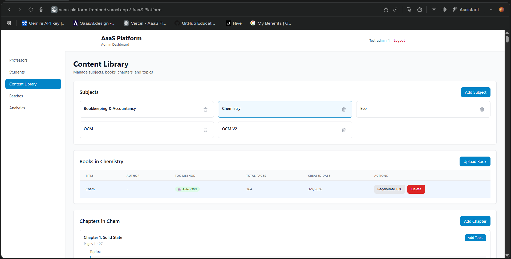

- Admin lands on the Content Library page after login, accessible from the left nav alongside Professors, Students, Batches, and Analytics
- The page is divided into three vertically stacked panels: **Subjects**, **Books in [Subject]**, and **Chapters in [Book]**
- Admin creates subjects (e.g., Chemistry, Bookkeeping & Accountancy, OCM) using the "Add Subject" button; subjects appear as deletable cards in a grid layout
- Clicking a subject card highlights it and loads its associated books in the panel below
- Books are uploaded via the "Upload Book" button — admin provides a PDF file along with author and publication metadata
- The system attempts **automatic TOC parsing** (AI-extracted, shown as "Auto · 90%" confidence) and falls back to manual entry if needed
- Each book row in the table shows: Title, Author, TOC Method (auto/manual + confidence %), Total Pages, Created Date, and Actions (Regenerate TOC / Delete)
- Below books, chapters are listed with their page ranges; admin can "Add Chapter" and "Add Topic" to build or refine the content hierarchy

**UX decision:** Collapsing the entire content management experience into a single scrollable page (rather than separate sub-pages) means admin can verify the full Subject → Book → Chapter → Topic chain without navigation hops — critical for catching TOC parsing errors before professors use the content.

---

### Screen 2: Topic Hierarchy (Admin Login)

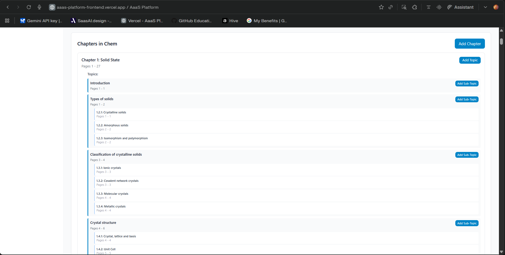

After a book is uploaded and processed, the admin sees a deep collapsible hierarchy representing the full chapter and topic structure extracted from the textbook.

- Structure follows: **Chapter → Topic → Sub-topic**, each node showing its page range (e.g., "Pages 1–27")
- Sub-topics are displayed with indented nesting and their own granular page ranges
- Admin can manually add chapters, topics, and sub-topics using contextual "Add" buttons on each node
- Each node is editable and refinable — the admin is the final authority on curriculum structure before it is used for assessment generation

**Example (Chemistry — Chem book):**
```
Chapter 1: Solid State (Pages 1–27)
  └── Introduction (Pages 1–1)
  └── Types of Solids (Pages 1–2)
        ├── 1.2.1: Crystalline solids (Pages 1–1)
        ├── 1.2.2: Amorphous solids (Pages 2–2)
        └── 1.2.3: Isomorphism and polymorphism (Pages 2–2)
  └── Classification of crystalline solids (Pages 3–4)
        ├── 1.3.1: Ionic crystals (Pages 3–3)
        ├── 1.3.2: Covalent network crystals (Pages 3–3)
        ├── 1.3.3: Molecular crystals (Pages 4–4)
        └── 1.3.4: Metallic crystals (Pages 4–4)
  └── Crystal structure (Pages 4–6)
        ├── 1.4.1: Crystal, lattice and basis (Pages 4–4)
        └── 1.4.2: Unit Cell (Pages 5–5)
```

**UX decision:** A flat list was prototyped first but discarded — it removed the curriculum context that professors rely on when selecting content for assessments. The hierarchical view mirrors the mental model of both admin (who sets it up) and professors (who consume it), making content targeting precise and academically credible.

---

### Screen 3: MCQ Assessment Generation — 4-Step Wizard (Professor Login)

**Step 1 — Basic Details**

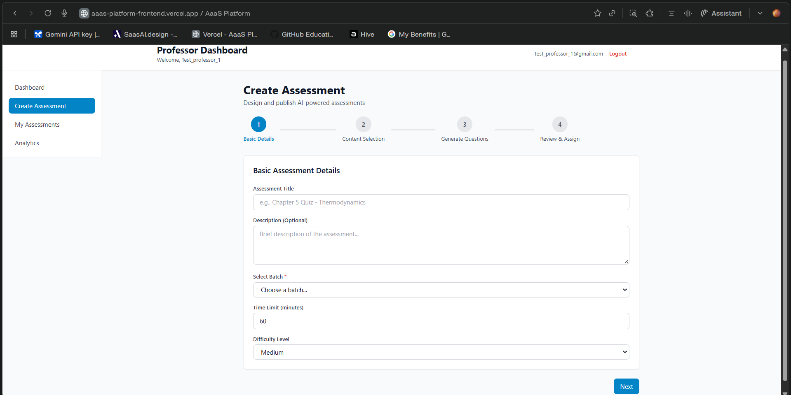

- Professor accesses "Create Assessment" from the left nav
- A 4-step progress bar (Basic Details → Content Selection → Generate Questions → Review & Assign) keeps the professor oriented throughout
- Step 1 captures: Assessment Title, Description (optional), Select Batch (dropdown), Time Limit (minutes), and Difficulty Level (Easy / Medium / Hard)
- Difficulty is set here globally for the assessment, though individual question quality is RAG-grounded regardless

**Step 2 — Content Selection**

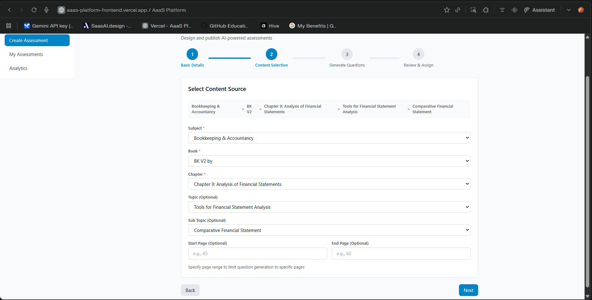

- Professor drills into the curriculum using cascading dropdowns: Subject → Book → Chapter → Topic (Optional) → Sub-Topic (Optional)
- A breadcrumb trail at the top of the panel dynamically updates to show the current selection path (e.g., Bookkeeping & Accountancy > BK V2 > Chapter 9: Analysis of Financial Statements > Tools for Financial Statement Analysis > Comparative Financial Statement)
- Optional Start Page and End Page fields allow further scoping of the RAG retrieval to a specific page range within the selected topic
- This level of precision ensures generated MCQs are grounded in exactly the right content chunks

**Step 3 — Generate Questions with AI**

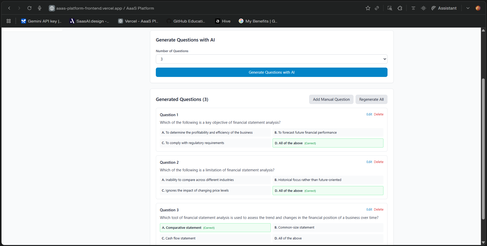

- Professor selects the number of questions from a dropdown and clicks "Generate Questions with AI"
- Vertex AI (Gemini) retrieves content chunks scoped to the selected chapter/topic/page range and generates MCQs
- Generated questions appear immediately in a card layout below: question stem + 4 options (A–D) with the correct answer highlighted in green
- Each question card has **Edit** and **Delete** links inline
- "Add Manual Question" and "Regenerate All" buttons are available at the top of the question list

**UX decision:** Splitting the wizard into 4 explicit steps rather than a single long form reduces cognitive load. Each step has a clear, bounded decision — professors make one type of choice at a time (metadata → content scope → generation → review), which maps naturally to how assessment creation is mentally sequenced.

---

### Screen 4: MCQ Review & Edit — Assessment Dashboard (Professor Login)

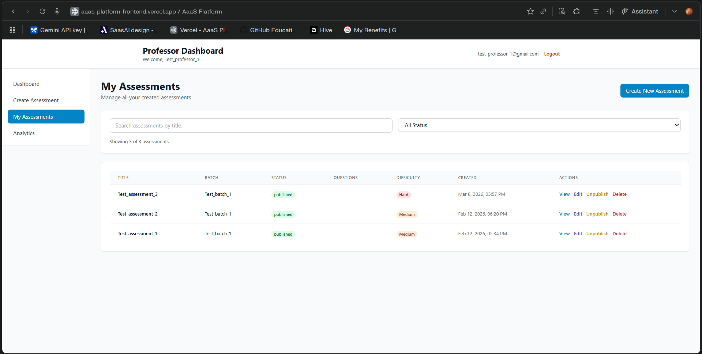

- The "My Assessments" dashboard lists all created assessments in a table with: Title, Batch, Status (published/draft), Questions count, Difficulty, Created timestamp, and Actions
- Per-assessment actions: **View**, **Edit**, **Unpublish**, **Delete** — all accessible inline without navigating away
- Status badges (published in green, draft in grey) give an at-a-glance operational overview
- Clicking Edit re-opens the wizard at the question review step, allowing professors to add, remove, or modify questions even after creation

**UX decision:** Exposing Unpublish as a first-class action (not buried in settings) reflects a key product insight — professors sometimes need to retract an assessment mid-cycle (e.g., if a question error is discovered after students have started). Making this recoverable and visible reduces the fear of publishing too early.

---

### Screen 5: Attempt MCQ Assessment (Student Login)

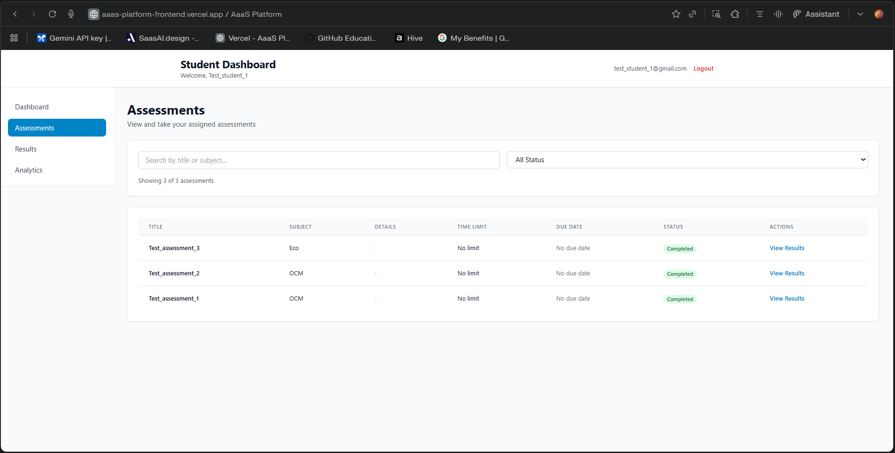

- Students see an "Assessments" tab in their dashboard listing all assigned assessments in a table: Title, Subject, Time Limit, Due Date, Status, and Actions
- Status badges indicate Completed / Pending states at a glance
- Completed assessments show a "View Results" link; pending ones show a "Start" button
- Students can filter by status ("All Status" dropdown) and search by title or subject
- During the attempt: one question is displayed at a time, a visible countdown timer runs, answers autosave in real time, and students can navigate between questions freely before final submission
- On submission, instant auto-grading delivers a score and per-question correctness breakdown (no manual grading wait)

**UX decision:** One-question-at-a-time navigation (rather than all questions on one scroll page) prevents students from scanning ahead and mirrors the format of formal examinations — reinforcing that this is a structured, credible assessment and not an informal worksheet.

---

### Screen 6: Add/Delete Professors (Admin Login)

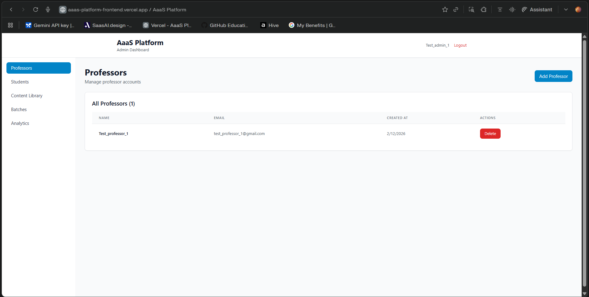

- Admin accesses "Professors" from the left nav on the Admin Dashboard
- The page shows a table of all professor accounts: Name, Email, Created At, and a Delete action button
- New professors are added via the "Add Professor" button (top right), which opens an inline form for name, email, and password
- Deletion is immediate via the red "Delete" button — no soft-delete or confirmation modal in MVP
- Admin can see exactly how many professors are registered (e.g., "All Professors (1)") with a live count

**UX decision:** Keeping professor management as a flat list (not paginated cards or nested profiles) reflects the expected scale at MVP — institutes typically have 5–30 professors, making a simple table sufficient and faster to scan than a card grid.

---

### Screen 7: Add/Delete Students (Admin Login)

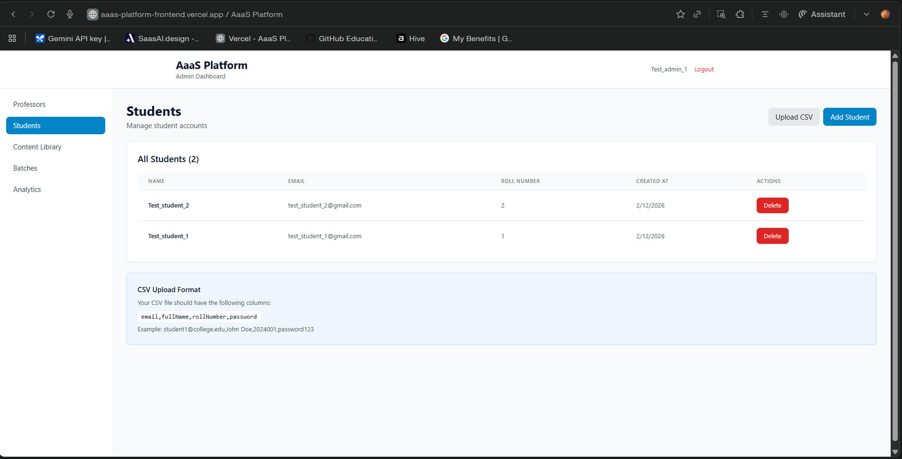
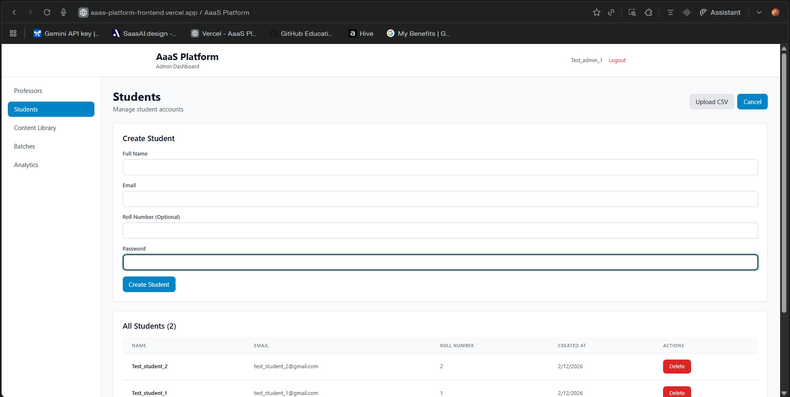

- Admin accesses "Students" from the left nav
- Two methods for adding students are available simultaneously: individual creation (form) and bulk upload (CSV)
- The **Create Student form** (shown inline when "Add Student" is clicked) captures: Full Name, Email, Roll Number (optional), and Password
- **CSV Upload** supports bulk onboarding; the accepted format is shown directly on the page as a helper: `email, fullName, rollNumber, password` (e.g., `student1@college.edu, John Doe, 2024001, password123`)
- The student table shows: Name, Email, Roll Number, Created At, and a Delete action per row
- Student count is displayed live (e.g., "All Students (2)")

**UX decision:** Showing the CSV format specification directly on the students page (rather than in documentation) eliminates the need for admins to search for formatting instructions — a friction point that caused errors in early testing with non-technical admin staff.

---

### Screen 8: Add/Delete Batch (Admin Login)

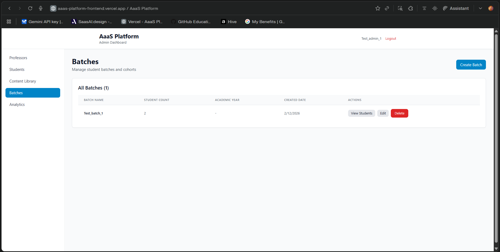

- Admin accesses "Batches" from the left nav to manage student cohorts
- The batches table shows: Batch Name, Student Count, Academic Year, Created Date, and Actions (View Students / Edit / Delete)
- New batches are created via the "Create Batch" button (top right), which accepts a batch name and optional academic year
- "View Students" lets the admin inspect and manage which students are assigned to a batch
- Batches are the unit of assessment distribution — professors publish assessments to a specific batch, so batch configuration is a prerequisite before any assessment can be published
- Delete removes the batch record; student accounts are not deleted (students persist independently of batch assignment)

**UX decision:** Separating batch management from student management (two distinct nav items) makes the admin's operational model clearer — students exist at the institute level, batches are a grouping layer on top. This prevents confusion between "deleting a batch" and "deleting students."

---

## Design Principles

**1. Teacher confidence over AI autonomy**
Every AI action is reviewable. The product never auto-submits or auto-shares. The teacher is the final decision-maker at every step.

**2. Syllabus as the source of truth**
MCQs are generated only from what's in the uploaded document. The product explicitly tells users: "Questions are grounded in your syllabus." This is a key differentiator from generic AI MCQ tools.

**3. Speed as the primary UX metric**
The end-to-end flow — upload to exported quiz — should complete in under 5 minutes for a standard syllabus. Every design decision was evaluated against this target.

**4. Mobile-first layout with desktop optimisation**
Teachers are often on mobile when reviewing materials. The upload + generate flow works on a phone. The review and edit screen is optimised for desktop where precision is needed.

---

## What Was Left Out of v1 (and Why)

| Feature | Reason Deferred |
|---|---|
| Student-facing practice mode | Would double the UX surface area; teacher workflow is the core hypothesis to validate first |
| LMS integrations (Moodle, Canvas) | API complexity and institutional procurement cycles — a v2+ bet |
| Question type variety (fill-in-the-blank, match the pairs) | MCQs are 80% of teacher demand; broader types risk diluting quality |
| Real-time collaboration | Nice-to-have; teachers work solo on assessments in practice |
| Performance analytics | Requires student data; only possible after student mode is shipped |

Every deferred feature has a clear unlock condition tied to either usage milestones or the v2 roadmap.
